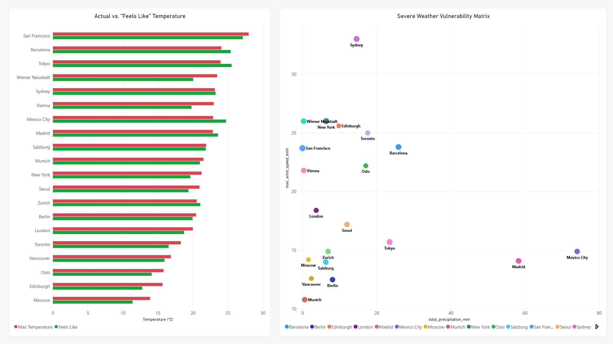
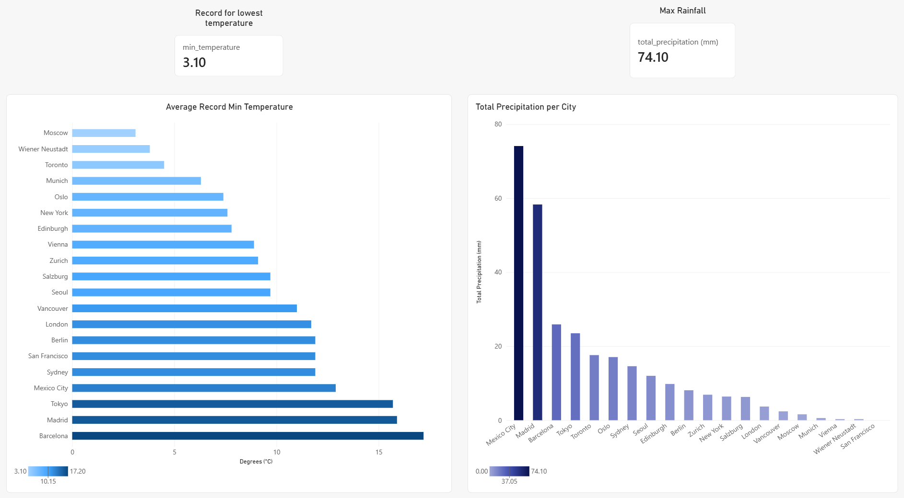

# 🌤️ Open-Meteo Weather Data Pipeline &amp; Analytics 

## Project Summary  
A Databricks data engineering project implementing a Medallion Architecture (Bronze, Silver, Gold) to analyze global weather patterns, seasonal temperature trends, human comfort metrics, and heat anomalies across 20 global locations.

## Overview

This project transforms raw, unstructured REST API responses into business-ready analytical Delta tables. Using multi-layered PySpark and Databricks SQL transformations, the pipeline standardizes daily forecast records, enforces strict schema structures, and aggregates core atmospheric metrics into analytical Gold layer views. Key analytical capabilities include:

* **Heat Anomaly & Window Tracking:** Quantifying daily temperature spikes using 3-day rolling window functions (`OVER PARTITION BY ... ORDER BY`) to detect extreme weather events (>5°C above the moving average).
* **Atmospheric & Solar Analysis:** Evaluating thermal comfort spreads (`temp_max` vs. `sensation_max_temp`), wind intensity, daylight availability, and solar radiation efficiency ratios.
* **City-Level Performance Summaries:** Aggregating historical weather metrics across global climate regions to report temperature extremes, total precipitation, and average daily sunshine hours.

## Data Architecture (Medallion Pipeline)

Data flows progressively through three layers inside Databricks using Unity Catalog and Unity Catalog Volumes:
* **Bronze Layer (Raw Ingestion):** Dynamically fetches multi-variable weather forecasts from the Open-Meteo REST API for 20 global cities and lands raw JSON payloads into Unity Catalog Volumes (`/Volumes/openmeteo/default/raw_weather/`).
* **Silver Layer (Cleaning & Enriched):** Direct Spark SQL parsing flattens nested arrays via `explode` and `arrays_zip`, standardizes data types, renames complex API variables (e.g., mapping `apparent_temperature` to `sensation_temp`), and materializes a structured Delta table (`openmeteo.default.weather_daily`).
* **Gold Layer (Curated Analytics):** Materializes aggregated analytical views and windowed metrics optimized for executive dashboards and BI reporting tools.

## Data Model 

The analytical output centers on structured, dimensional datasets tailored for weather metrics and spatial reporting:

* **Primary Fact/Analytics Table:** `gold_weather_analytics` (Contains daily granular weather observations, rolling moving averages, sunshine ratios, and anomaly flags).
* **Summary Dimension Table:** `gold_city_weekly_summary` (Contains aggregated city-level KPIs, temperature extremes, total rainfall, and average daily sunshine hours).

## Tools & Technologies

* **Platform:** Databricks
* **Governance & Storage:** Unity Catalog Volumes, Delta Lake
* **Languages:** Python (PySpark, Requests), Databricks SQL (CTEs, Window Functions, Aggregate Functions, Conditional Logic)
* **Data Architecture:** Medallion Architecture (Bronze ➔ Silver ➔ Gold)
* **External API:** Open-Meteo Forecast & Geocoding REST API

## Key Weather Analytics & Insights

Visual 1 (General Overview): 

* **Temperature Trends & Variance:** Peak temperature reached near **29°C on Oct 02**, followed by a steady cooling trend down to ~18°C by Oct 07. "Feels Like" temperatures consistently track below actual maximums toward the end of the period, indicating drier air or cooling wind conditions.
* **Solar Potential Efficiency:** New York demonstrates exceptionally high solar efficiency, with **Sunshine Hours (~11.4 hrs)** matching nearly **100% of available Daylight Hours (~11.8 hrs)**, reflecting minimal cloud cover interference.

Visual 2 (Comparative & Risk Analysis): 

* **Perceived vs. Actual Temperature Variance:** San Francisco leads overall peak temperatures near **28°C**, closely matching its "Feels Like" index. In contrast, locations like Wiener Neustadt, Vienna, and New York display a noticeable drop in perceived temperature relative to maximum recorded levels—signaling strong wind chill or low relative humidity during warm spells.
* **Severe Weather Vulnerability Profiling:** The multi-variable scatter plot maps operational exposure by plotting peak wind gusts (`max_wind_speed_kmh`) against cumulative rainfall (`total_precipitation_mm`):
  * **High Wind Risk:** Sydney stands out with severe wind activity exceeding **32 km/h**, despite low total precipitation.
  * **High Precipitation Risk:** Mexico City (~74 mm) and Madrid (~58 mm) represent extreme rainfall zones with lower wind exposure.

Visual 3 (Extreme Weather & Risk Dashboard):

* **Coldest Locations Analysis:** Moscow captures the lowest minimum temperature at **3.10 °C**, closely followed by Wiener Neustadt (~4 °C) and Toronto (~4.5 °C). Conversely, coastal and southern locations like Barcelona anchor the upper bound of record minimums at **17.20 °C**.
* **Precipitation Distribution:** Rainfall accumulation is heavily concentrated in a few key metropolitan areas, peaking with Mexico City at **74.10 mm** and Madrid at **58.30 mm**. Most remaining cities recorded under **25 mm** during the observed period.
* **Macro KPI Highlights:** Establishes key threshold metrics across all monitored regions—pinpointing the absolute minimum temperature benchmark (**3.10 °C**) and peak cumulative rainfall (**74.10 mm**).
