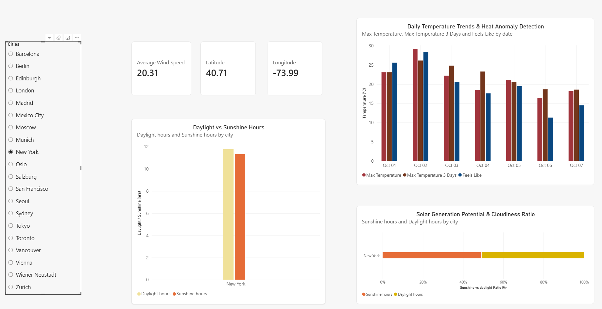

# 🌤️ Open-Meteo Weather Data Pipeline &amp; Analytics 

## Project Summary  
A Databricks data engineering project implementing a Medallion Architecture (Bronze, Silver, Gold) to analyze global weather patterns, seasonal temperature trends, human comfort metrics, and heat anomalies across 20 global locations.

## Overview

This project transforms raw, unstructured REST API responses into business-ready analytical Delta tables. Using multi-layered PySpark and Databricks SQL transformations, the pipeline standardizes daily forecast records, enforces strict schema structures, and aggregates core atmospheric metrics into analytical Gold layer views. Key analytical capabilities include:

* **Heat Anomaly & Window Tracking:** Quantifying daily temperature spikes using 3-day rolling window functions (`OVER PARTITION BY ... ORDER BY`) to detect extreme weather events (>5°C above the moving average).
* **Atmospheric & Solar Analysis:** Evaluating thermal comfort spreads (`temp_max` vs. `sensation_max_temp`), wind intensity, daylight availability, and solar radiation efficiency ratios.
* **City-Level Performance Summaries:** Aggregating historical weather metrics across global climate regions to report temperature extremes, total precipitation, and average daily sunshine hours.

## Data Architecture (Medallion Pipeline)

Data flows progressively through three layers inside Databricks using Unity Catalog and Unity Catalog Volumes:
* **Bronze Layer (Raw Ingestion):** Dynamically fetches multi-variable weather forecasts from the Open-Meteo REST API for 20 global cities and lands raw JSON payloads into Unity Catalog Volumes (`/Volumes/openmeteo/default/raw_weather/`).
* **Silver Layer (Cleaning & Enriched):** Direct Spark SQL parsing flattens nested arrays via `explode` and `arrays_zip`, standardizes data types, renames complex API variables (e.g., mapping `apparent_temperature` to `sensation_temp`), and materializes a structured Delta table (`openmeteo.default.weather_daily`).
* **Gold Layer (Curated Analytics):** Materializes aggregated analytical views and windowed metrics optimized for executive dashboards and BI reporting tools.

## Data Model 

The analytical output centers on structured, dimensional datasets tailored for weather metrics and spatial reporting:

* **Primary Fact/Analytics Table:** `gold_weather_analytics` (Contains daily granular weather observations, rolling moving averages, sunshine ratios, and anomaly flags).
* **Summary Dimension Table:** `gold_city_weekly_summary` (Contains aggregated city-level KPIs, temperature extremes, total rainfall, and average daily sunshine hours).

## Tools & Technologies

* **Platform:** Databricks
* **Governance & Storage:** Unity Catalog Volumes, Delta Lake
* **Languages:** Python (PySpark, Requests), Databricks SQL (CTEs, Window Functions, Aggregate Functions, Conditional Logic)
* **Data Architecture:** Medallion Architecture (Bronze ➔ Silver ➔ Gold)
* **External API:** Open-Meteo Forecast & Geocoding REST API

## Key Weather Analytics & Insights

Visual 1 (General Overview): Graphs/Weather_1.png

- Operational Metrics: Establishes cross-city macro-climate baselines across temperature trends, solar duration, and wind profiles.
- Data Ingestion: Aggregates processed multi-region metrics from the Medallion Gold summary layer to provide an initial high-level exploratory view.

Visual 2 (Comparative & Risk Analysis): Graphs/Weather_2.png
- Actual vs. "Feels Like" Discrepancy: Evaluates humidity and wind chill divergence using a Clustered Bar Chart to assess real thermal impact across monitored urban hubs.
- Severe Weather Vulnerability Matrix: Maps Maximum Wind Speed (km/h) against Total Precipitation (mm) in a Scatter Plot to isolate severe weather outliers (e.g., high precipitation in Mexico City and Madrid, elevated wind risks in coastal Sydney).

Visual 3 (Extreme Weather & Risk Dashboard): Graphs/Weather_3.png
- Coldest Recorded Locations: Uses record_min_temp to dynamically isolate and rank cities experiencing extreme freezing thresholds.
- Heavy Precipitation & Anomaly Tracking: Highlights localized rainfall extremes to support municipal risk modeling, energy grid planning, and infrastructure impact assessments.
